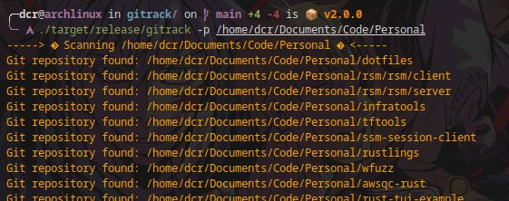
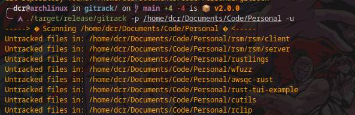

# gitrack

I have a lot of personal/work repositories in my laptop. Sometimes you jump from change to change and forget to upload the commit. This tool looks for untracked changes in your local folders.

Easy and simple.

# Supported Platforms

| Arch   | ARM64 | AMD64 |
|--------|-------|-------|
| darwin | ✅     | ✅   |
| linux  | ✅     | ✅   |

# Installation

* **[Install Cargo](https://rustup.rs/)**

Open a terminal and run:

```shell
git clone https://github.com/containerscrew/gitrack
cd gitrack
make install
```

# Uninstall

```shell
make uninstall
```

# Usage

```bash
gitrack --help
```

> By default, it will look for untracked changes in your home folder.

Scanning for untracked changes, specific folder:

```bash
gitrack -p /my/folder/path
```

Summarized output:

```bash
gitrack -p /my/folder/path -s
gitrack -s # remember without -p will scan your home folder
```

Number of workers/threads:

```bash
gitrack -p /home/elliot -w 3
```

# Threads

> The use of threads is not really necessary in this type of tools, unless you have a very large file/folder system. Adding threads does not mean always better performance. I have included them in order to practice their use. **Max 5 threads, default 3**

# Local container

```bash
cd gitrack/
docker run -it --rm -w /app -h gitrack --name gitrack -v $PWD:/app docker.io/rust:1.80.1-slim-bullseye
```

# Example

Scan personal folder summarized:



Scan specific folder with details:



# TODO

* Implement git commit scan for sensitive data using regex. Just for fun. Like gitleaks does.
* Support diff files.
* Control threads

# Links

* [Using cargo in CI](https://doc.rust-lang.org/cargo/guide/continuous-integration.html)

# License

[License](./LICENSE)
