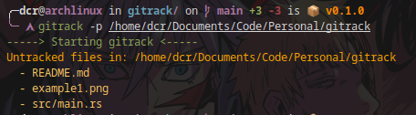

# gitrack

I have thousands of personal/work repositories in my laptop. Sometimes you jump from change to change and forget to upload the commit. This tool looks for untracked changes in your local folders.

Easy and simple.

# Installation

* **[Install Cargo](https://rustup.rs/)**

Then run:

```shell
git clone https://github.com/containerscrew/gitrack
cd gitrack
cargo install --path .
```

# Usage

```shell
gitrack --help
```

> By default, it will look for untracked changes in your home folder.

Scanning for untracked changes, specific folder:

```shell
gitrack -p /my/folder/path
```

Summarized output:

```shell
gitrack -p /my/folder/path -s
gitrack -s # remember without -p will scan your home folder
```

# Example

Scan personal folder summarized:


Scan specific folder with details:



# TODO

* Implement git commit scan for sensitive data using regex. Just for fun. Like gitleaks does.

# License

[License](./LICENSE)