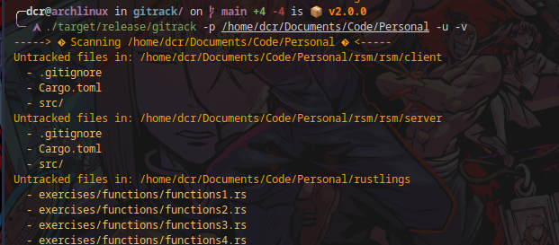

# gitrack

<!-- START doctoc generated TOC please keep comment here to allow auto update -->
<!-- DON'T EDIT THIS SECTION, INSTEAD RE-RUN doctoc TO UPDATE -->
**Table of Contents**  *generated with [DocToc](https://github.com/thlorenz/doctoc)*

- [About](#about)
- [Badges](#badges)
- [Supported Platforms](#supported-platforms)
- [Installation](#installation)
  - [Install latest version](#install-latest-version)
  - [Install specific release](#install-specific-release)
  - [Using cargo](#using-cargo)
- [Uninstall](#uninstall)
- [Usage](#usage)
  - [Help](#help)
  - [Scan folders containing git repositories](#scan-folders-containing-git-repositories)
  - [Scanning for untracked changes (summarized)](#scanning-for-untracked-changes-summarized)
  - [Scanning for untracked changes (verbose)](#scanning-for-untracked-changes-verbose)
  - [Diff files for untracked changes](#diff-files-for-untracked-changes)
  - [Control number of workers/threads:](#control-number-of-workersthreads)
  - [Exclude directories:](#exclude-directories)
- [About threads](#about-threads)
- [Dev](#dev)
  - [pre-commit](#pre-commit)
  - [Local container](#local-container)
- [Examples](#examples)
  - [Scan personal folder summarized](#scan-personal-folder-summarized)
  - [Scan specific folder with details](#scan-specific-folder-with-details)
  - [Diff files](#diff-files)
- [TODO](#todo)
- [License](#license)

<!-- END doctoc generated TOC please keep comment here to allow auto update -->

# About

Scan git repositories in your file system. Find untracked changes, diff files, and more.

Easy and simple. This tool was created just for fun and to practice Rust.

Implemented features:

* Scan for untracked changes in git repositories.
* Scan `.git` folders in your file system (with multithreads).
* Diff files for untracked changes.


# Badges

|              |                                                                                                                                                                                                                                                    |
|--------------|----------------------------------------------------------------------------------------------------------------------------------------------------------------------------------------------------------------------------------------------------|
| Language     |                                                                                                                                              |
| Release      | [](https://github.com/containerscrew/gitrack/releases/latest)                                                                                                              |
| Code         |                                                                                                                                                              |
| CI - Build   | [](https://github.com/containerscrew/gitrack/actions/workflows/build.yml)                                                                                 |
| CI - Release | [](https://github.com/containerscrew/gitrack/actions/workflows/release.yml)                                                                             |
| CI - Test    | [](https://github.com/containerscrew/gitrack/actions/workflows/test.yml)                                                                                   |
| Meta         | [](https://github.com/pre-commit/pre-commit) [](/LICENSE) |
| Codecov      | [](https://codecov.io/gh/containerscrew/gitrack)                                                                                                          |
| Downloads    | [](https://somsubhra.github.io/github-release-stats/?username=containerscrew&repository=gitrack)                                                 |

# Supported Platforms

| Arch   | ARM64 | AMD64 |
|--------|-------|-------|
| darwin | ✅     | ✅   |
| linux  | ✅     | ✅   |

# Installation

## Install latest version

```shell
curl --proto '=https' --tlsv1.2 -sSfL https://raw.githubusercontent.com/containerscrew/gitrack/main/install.sh | sh
```

## Install specific release

```shell
curl --proto '=https' --tlsv1.2 -sSfL https://raw.githubusercontent.com/containerscrew/gitrack/main/install.sh | sh -s -- -v "v0.8.0"
```

## Using cargo

* **[Install Cargo](https://rustup.rs/)**

Open a terminal and run:

```shell
git clone https://github.com/containerscrew/gitrack
cd gitrack
make install
```

# Uninstall

```bash
sudo rm /usr/local/bin/gitrack
```

With cargo:

```shell
make uninstall
```

# Usage

## Help

```bash
gitrack --help

Scan git repositories in your file system

Usage: gitrack [OPTIONS]

Options:
  -p, --path <PATH>               Folder path you want to scan for git untracked files [default: /home/dcr]
  -w, --workers <WORKERS>         Number of threads to use for scanning repositories [default: 5]
  -d, --diff                      Show differences between changed files
  -e, --exclude-dir <EXCLUDE>...  Exclude directories to scan
  -u, --check-untracked           Only show repositories with untracked files
  -v, --verbose                   Print verbose output
  -h, --help                      Print help
  -V, --version                   Print version
```

## Scan folders containing git repositories

```bash
gitrack -p /home/elliot # home will be always the default values if -p is not provided
```

## Scanning for untracked changes (summarized)

```bash
gitrack -p /home/elliot -u
```

## Scanning for untracked changes (verbose)

```bash
gitrack -p /home/elliot -u -v
```

## Diff files for untracked changes

```bash
gitrack -p /home/elliot -u -d # without -u, -d will not work
```

## Control number of workers/threads:

```bash
gitrack -p /home/elliot -u -w 6
```

## Exclude directories:

```bash
gitrack -p /home/elliot -e "/home/elliot/.cache" -e "/home/elliot/.local" -u -w 6
```

# About threads

> The use of threads is not really necessary in this type of tools, unless you have a very large file/folder system. Adding threads does not mean always better performance. I have included them in order to practice their use.

# Dev

## pre-commit

```bash
cd gitrack/
pre-commit install
```

## Local container

```bash
cd gitrack/
docker run -it --rm -w /app -h gitrack --name gitrack -v $PWD:/app docker.io/rust:1.80.1-slim-bullseye
```

# Examples

## Scan personal folder summarized


## Scan specific folder with details


## Diff files



# TODO

* Implement git commit scan for sensitive data using regex. Just for fun. Like gitleaks does.


# License

[License](./LICENSE)
